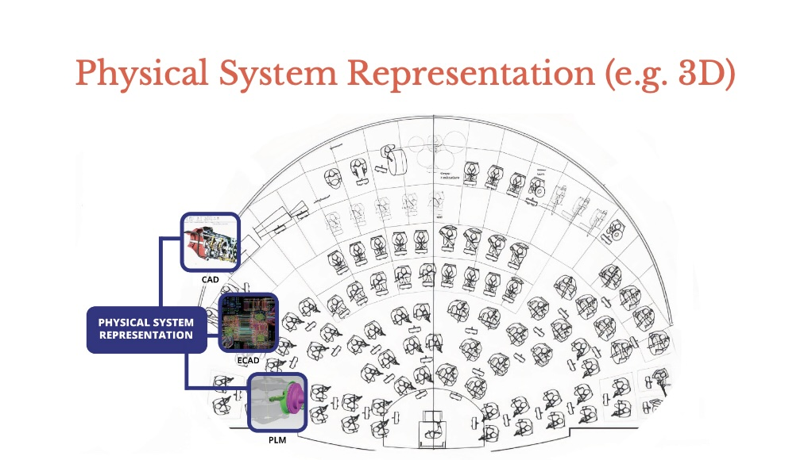

# 1.2 ECAD (Electronic Computer-Aided Design)

This folder houses all **ECAD-related model definitions** under the **Physical System Representation** class. ECAD tools focus on **electronic** aspects of a design (e.g., schematic capture, PCB layout, circuit simulation), complementing the mechanical aspects found in `1.1-CAD/`.



> *Figure 1.* The Physical System Representation Class overview, which includes CAD (mechanical), ECAD (electronic) and PLM ModelTypes.

---

## Structure

1. **`1.2.1-instances/`**  
   - Contains **JSON definitions** for each ECAD model instance (e.g., AltiumDesigner, OrCAD, KiCad, SPICE).
   - Each file follows the standard format:
     ```jsonc
     {
       "Tool": {
         "Class": "Physical System Representation",
         "Type": "ECAD",
         "Instance": "VendorToolName",
         "Vendor": "...",
         "Version": "...",
         "POC": { "Name": "...", "Email": "..." }
       },
       "Licensing": {
         "Type": "...",
         "Server": { ... }
       },
       "Access_Control": {
         "IAM": "..."
       },
       "Deployment": {
         "Level": "...",
         "Type": "...",
         "InfoSec_Level": ["..."]
       },
       "Plugins": [ ... ]
     }
     ```
   - This structure ensures each **ECAD tool** is consistently described (vendor info, licensing, deployment, etc.).

2. **`Example_DiD/`**  
   - An **optional** folder for example Data Item Description artifacts or demonstration materials (like `.pdf` references, additional JSON examples).
   - Could also host sample outputs (fabrication data, netlists) or a mock DID document (e.g., `DI-MNT-ECAD_Example.pdf`).

3. **`images/`**  
   - Stores **ECAD-specific** images: schematic diagrams, PCB layout screenshots, etc.
   - Use these in a local `README.md` or DiD docs to illustrate best practices.

4. **`1.2.2-ECAD_Loading_Input_Data.json`**  
   - Defines how **ECAD tools** typically receive data (schematics, netlists, BOM spreadsheets, mechanical outlines for MCAD-ECAD collaboration, etc.).

5. **`1.2.3-ECAD_Extraction_Output_Data.json`**  
   - Specifies what data **ECAD** can output (Gerber/ODB++ for fabrication, netlists, BOM, assembly drawings, etc.).

6. **`ECAD_Extraction_Output.owl`** *(Optional)*  
   - If you choose to adopt a **semantic** approach, this `.owl` file can represent the same concepts (schematic files, PCB layout, netlists) in an ontology.  
   - Maintains alignment with your **JSON-based** schema approach while enabling advanced queries or reasoning if needed.

---

## ECAD Tools Overview

In **`1.2.1-instances/`**, you’ll find JSON files for:

- **Altium Designer** (`1.2.1.1-ECAD_AltiumDesigner.json`): A popular PCB layout and schematic solution.  
- **OrCAD** (`1.2.1.2-ECAD_OrCAD.json`): Another industry-standard for schematic capture and PCB design.  
- **KiCad** (`1.2.1.3-ECAD_KiCad.json`): An open-source ECAD suite supporting schematic and PCB layout.  
- **SPICE** (`1.2.1.4-ECAD_SPICE.json`): Circuit simulation tool for waveforms and circuit analysis, referencing variants like PSpice, LTspice, or NGSpice.

These definitions mirror the same structure used in **`1.1-CAD/1.1.1-instances/`** but for **ECAD**.

---

## How to Use

1. **Load/Extraction Schemas**:  
   - **`1.2.2-ECAD_Loading_Input_Data.json`** describes standard input data (like `.schdoc`, `.brd`, `.ipc`, `.gerber`, netlists).  
   - **`1.2.3-ECAD_Extraction_Output_Data.json`** outlines typical outputs (ODB++, BOM, assembly drawings, netlists, fabrication files).

2. **Create/Update Instances**:  
   - If you have a new ECAD vendor tool, copy one of the existing JSON definitions, rename it (e.g., `1.2.1.5-ECAD_Eagle.json`), and fill in the vendor/version details.

3. **Example DiDs**:  
   - Look into `Example_DiD/` for demonstration references or Data Item Description artifacts.  
   - Add new PDF or JSON examples if you want to show how a real project might deliver ECAD data.

---

## Relationship to Other Model Types

- **1.1-CAD** covers mechanical design.  
- **1.2-ECAD** covers electronics design (PCBs, schematics, circuit simulation).  
- In many programs, these two “representations” must be kept **in sync** via MCAD-ECAD collaboration steps (e.g., board outlines from CAD → ECAD; BOM merges, etc.).

For **Simulations** (like signal integrity or thermal analysis), you may also reference data from **ECAD**. That data might feed into a **Simulations** model type (like EM or CFD) for advanced board-level analysis.

---

## Future Extensions

- **ECAD to Ontology**: If advanced semantics or cross-tool reasoning is needed, check out the optional `ECAD_Extraction_Output.owl` for a demonstration of how to represent netlists, BOMs, or layout data in an ontology format.  
- **Integration with MBSE**: Link schematic or netlist references to system blocks in MBSE (SysML parametric diagrams, requirement references).

---

## Questions or Feedback

- **Contact** the Digital Engineering team or see the main `[README](../../README.md)` in the `0_Model_Classes/` folder for the overall repository structure.  
- For usage guidelines, see `[docs/USAGE.md](../../../docs/USAGE.md)` or check `[docs/CONTRIBUTING.md](../../../docs/CONTRIBUTING.md)` if you plan to add a new ECAD instance or revise existing schemas.

**Happy PCB designing and circuit simming!** The **ECAD** domain ensures we capture all essential electronic aspects of system design, just as CAD addresses mechanical geometry.
