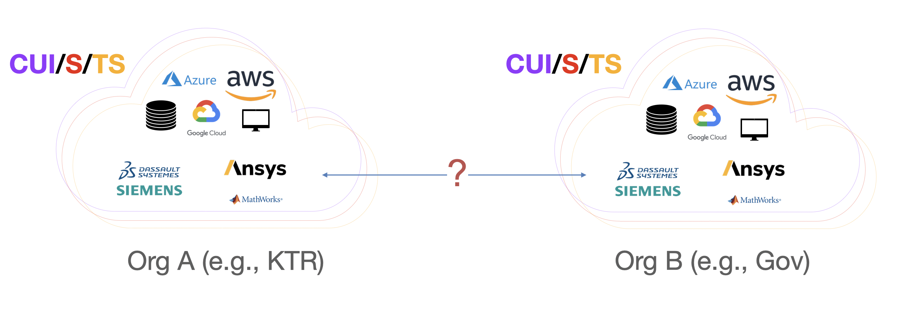
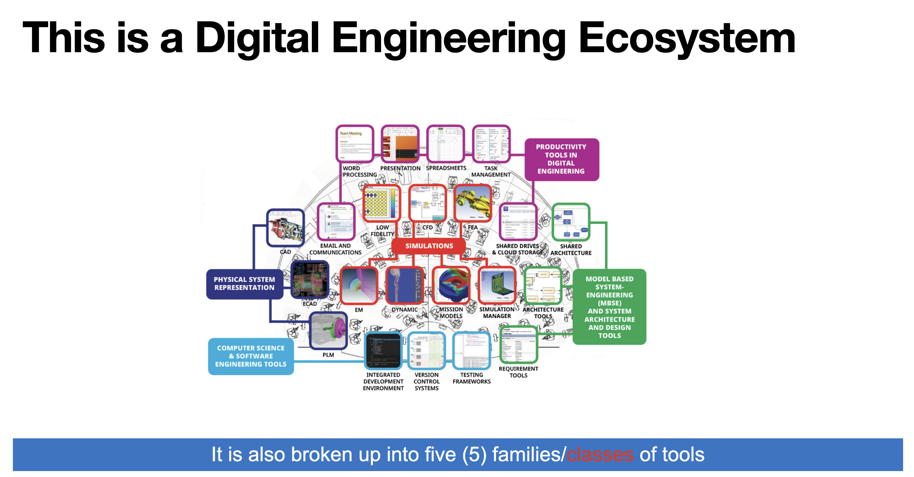
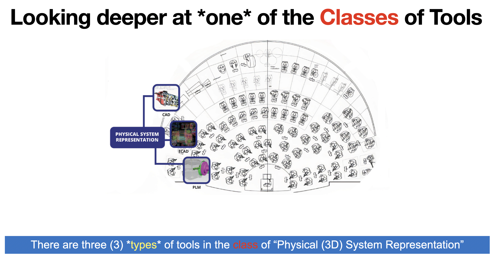
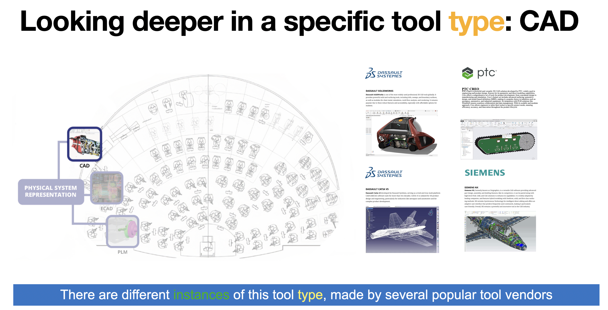
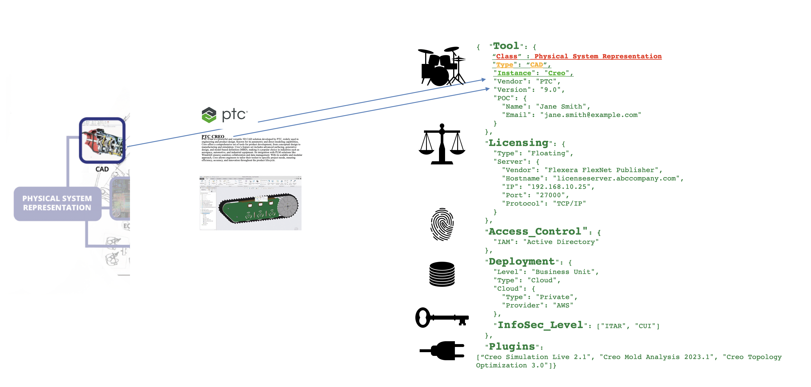
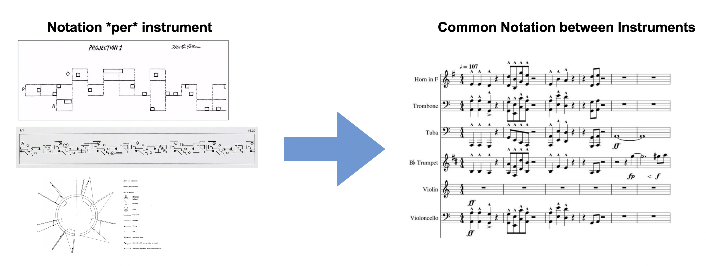
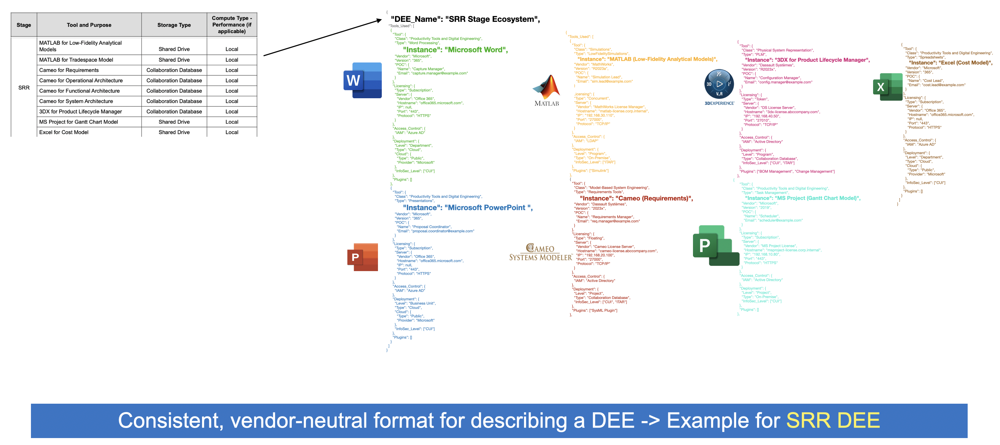
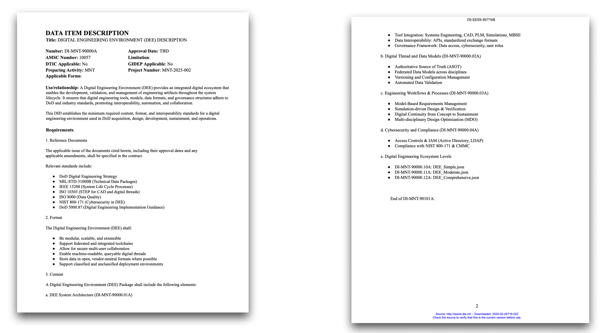

# DEE_Config (Digital Engineering Ecosystem Configuration)

Welcome to the **DEE_Config** folder within the **Open_Orchestra_Mod-Sim_DIDS** repository. This directory houses various **configuration files** and **example JSON** that outline how our **Digital Engineering Ecosystems (DEE)** are organized and orchestrated across different security levels, model types, and tool families.

## The Orchestra Analogy

Think of this entire digital engineering environment as an **orchestra**:
- Each **family of models** (e.g., **CAD**, **Simulations**, **MBSE**, **Software**, **Productivity**) is like a **section** in the orchestra (strings, woodwinds, brass, percussion, keyboards).

- Each **model type** (e.g., **Parametric CAD, CFD, FEA, MBSE Architecture, Version Control**) is like an **instrument** in the orchestra (violin, flute, trombone, piano, drums), each serving a distinct role within the engineering workflow.

- Individual **model instances** (e.g., **PTC Creo**, **ANSYS Fluent**, **Cameo**, **GitLab**) are the **vendor-specific-instruments**—each with its own unique sound (capabilities), vendor, licensing, and input/output data formats.

  
- A **Digital Data Item Description (DiD)** or **DEE configuration** provides the **sheet music**, telling each “instrument” how to play, when to come in, and how to stay in sync with the entire ensemble.

By standardizing how each tool is described and integrated, we can achieve a harmonious digital environment—no different from how an orchestra follows **common notation** to perform a unified symphony.

## What’s Inside This Folder?

1. **`Digital_Ecosystem_DID/`**  
   - Documents and examples illustrating **Data Item Descriptions** for a complete digital ecosystem.  
   - Offers a “notation system” for how each DEE or tool is represented, ensuring consistent usage.

2. **`Example_DEE_Config_Files/`**  
   - JSON examples (like `DEE_RFI.json`, `DEE_RFP.json`, etc.) showing how we define **Digital Engineering Ecosystems** at various project stages.  
   - A CSV example (`DEE_OverTime_Example.csv`) outlines how tools evolve from one milestone to the next.

3. **`Classes_and_Types.json`**  
   - Master reference linking each **tool class** (e.g., “Physical System Representation”) to **sub-types** (e.g., “CAD,” “ECAD,” “PLM”).  
   - Aligns with the “families of instruments” concept in our orchestra analogy.

## Why These Config Files Matter

- **Collaboration**: Multiple teams, classification levels, and vendors can coordinate if tools share a consistent “language” (like sheet music for the orchestra).
- **Traceability**: Defines which tools are used at which project stage (RFI, RFP, Proposal, etc.), what data they produce, and how that data is consumed downstream.
- **Interoperability**: JSON-based definitions ensure minimal friction in exchanging metadata, version info, and input/output schemas, across tools or organizations.
- **Security & Classification**: Identifies InfoSec levels (ITAR, CUI, etc.) associated with each tool, ensuring correct usage in multi-level environments.

## The Digital Engineering Orchestra in Action

An orchestra performs best when:
1. **Musicians** (engineers) are aligned with the conductor’s signals (project leads).  
2. **Sheet music** (digital data item descriptions) is consistent and unambiguous.  
3. Each **instrument** (tool) is tuned (properly configured) and in the correct section (model class/family).

Similarly, these **DEE Config** files:
- Provide a clear **model** of which tools are “playing” at each milestone (RFI, RFP, etc.).  
- Document their **roles** (CAD for mechanical geometry, simulation for performance analysis, MBSE for system architecture, etc.).  
- Ensure each tool’s **input/output** aligns with the broader digital engineering data flows.

## How To Use

1. **Browse Example Config Files**  
   - Look in `Example_DEE_Config_Files/` to see JSONs like `DEE_RFI.json` describing which tool “instruments” are used at the RFI stage.

2. **Adjust for Your Program**  
   - If you have additional tool classes or different stage definitions, create or modify a config JSON to reflect your ecosystem.

3. **Integrate with Model Classes**  
   - Each tool reference links back to the `0_Model_Classes/` folder (or your local variant), where you can find **instances** describing licensing, deployment, and version.

4. **Maintain Consistency**  
   - Update `Classes_and_Types.json` if you add new families or sub-types.  
   - Keep your stage definitions coherent across the entire repo so that each milestone consistently references the same core data.

## Next Steps

- **Add** your own Digital Ecosystem config files for specific DoD programs, adjusting the analogy or format as needed.  
- **Link** these references to the **DID** documents in `Digital_Ecosystem_DID/` to maintain a common, vendor-neutral format.

## Contact & Support

For more details about this “Digital Engineering Orchestra” approach, see our main [README](../README.md) or contact the **Author** at `cbenson@istaridigital.com`.

---

**Remember:** By orchestrating your digital tools under one standardized DEE configuration, you’re ensuring that each instrument—be it CAD, simulation, or MBSE—contributes to a **harmonious** engineering environment. 
