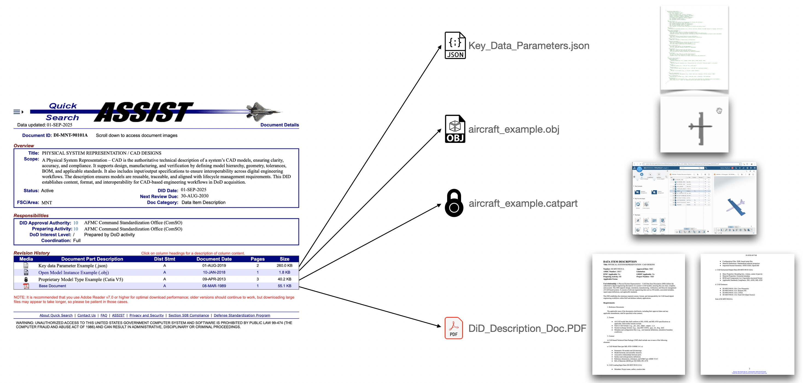

# All of this work done in collaboration with the OMG MBACQ User Group.... to be migrated to an official OMG Repo soon!


# Open Orchestra Modeling and Simulation Data Item Description Repository

Welcome to the **Open Orchestra** repository for **Modeling and Simulation Data Item Descriptions (DiDs)**! This repo organizes **model definitions**, **model schemas**, and **Digital Engineering Ecosystems (DEEs)** for our organization, especially focusing on **DoD aircraft design** and beyond.


> *Figure 1.* The goal of this effort is to allow organizations who may use different tools, modeling paradigms or work at different classification levels can work together more effectively


---

## Hierarchy: Model Classes → Model Types → Model Instances

1. **Model Classes**  
   - The broad **families** (or “sections”) of models that capture high-level domains (e.g., **PhysicalSystemRepresentation**, **Simulations**, **MBSE**, **ComputerScienceSoftwareEngineering**, **ProductivityAndDigitalEngineering**).


> *Figure 2.* Each **Model Class** (e.g., PhysicalSystemRepresentation, Simulations, MBSE) contains **Model Types**, which in turn define **Model Instances** for specific vendor solutions.


2. **Model Types**  
   - Subcategories within each Model Class. For instance:
     - **CAD**, **ECAD**, **PLM** (under PhysicalSystemRepresentation),
     - **CFD**, **FEA**, **EM**, **Dynamic**, **MissionModels**, **SimulationManagers** (under Simulations),
     - **RequirementsTools**, **ArchitectureTools**, **SharedArchitecture** (under MBSE), etc.
    
  
   > *Figure 2a.* An expanded look at the Model Types (e.g., CAD, eCAD, PLM) within the Physical System Representation Model Class 


3. **Model Instances**  
   - Concrete, vendor-specific model definitions, such as **CAD_CreoParametric.json** or **CFD_OpenFOAM.json**. Each instance includes version, licensing, deployment, and InfoSec details.

 
   > *Figure 2b.* A closer look at a the Model Instances (e.g., Creo, Solidworks, NX) within a Model Type (CAD)


 
   > *Figure 2c.* A closer look at a how a specific tool instance (e.g., Creo) can be described uniformly

This layered approach ensures **consistency**, **discoverability**, and **traceability** across multiple domains and classification levels.

---

## The Orchestra Analogy

Think of these **Model Classes** and **Types** as **instrument sections** and **families** in an **orchestra**:

- **Model Classes** = **Sections** (strings, brass, woodwinds…)  
- **Model Types** = **Families of instruments** (violins, violas, cellos under strings…)  
- **Model Instances** = **Individual instruments** (a specific Stradivarius violin #123)

Our **Data Item Descriptions (DiDs)** and **schema** files serve as the **“sheet music”**, providing a vendor-neutral notation so each “instrument” (model) can **harmonize** within the larger Digital Engineering ecosystem.

 
   > *Figure 3* Analogy for the common language **between** models

---

## Repository Layout

1. **docs/**  
   - Contains usage instructions (`USAGE.md`) and contribution guidelines (`CONTRIBUTING.md`).

2. **schema/**  
   - Holds classification files (e.g., `families_and_types.json`) defining official Model Classes and Types.

3. **ecosystems/**  
   - Defines **Digital Engineering Ecosystems (DEE)** in JSON form, specifying which **Model Instances** come together for particular program phases (e.g., `DEE_Simple.json`, `DEE_Comprehensive.json`).
  
 
   > *Figure 4* Example of a JSON Schema for a Digital Engineering Environment needed for a System Requirements Review

4. **model-classes/**  
   - Main structure organized by **Model Classes** (level 1).  
   - Within each class folder, subfolders for **Model Types** (level 2).  
   - Each **Model Type** contains:
     - A `README.md` describing that domain,
     - An `instances/` folder holding JSON definitions for **Model Instances** (level 3),
     - Two schema files describing **input** (`*_Loading_Input_Data.json`) and **output** (`*_Extraction_Output_Data.json`) for that domain.
    


 
   > *Figure 5* Example of a 'Digital DID' for CAD

---
## Getting Started

1. **Clone** this repository:
   ```bash
   git clone https://github.com/YourOrg/digital-eng-tools.git

2.  **Review** the relevant model-classes/ folder to see tool definitions for your domain (e.g., CAD, PLM, Requirements).

3.  **Check** ecosystems/ to understand how multiple tools combine to form a Digital Engineering environment.

4.  **Refer** to [docs/USAGE.md](docs/USAGE.md) for in-depth instructions, and [docs/CONTRIBUTING.md](docs/CONTRIBUTING.md) if you plan to submit changes.
